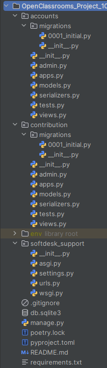

# Django app - OpenClassrooms Project 10
**Develop a web application using Django**

---

## DESCRIPTION

This project was completed as part of the "Python Developer" path at OpenClassrooms.

The goal was to develop a secured API Restful using Django REST Framework capable of:
- serving front-end applications on different platforms
- processing datas in a standard way

The application must:
- comply with OWASP security and optimization requirements
- comply with the "green code" requirements
- comply with GDPR specifications

---

## PROJECT STRUCTURE
<p align="center">
    
</p>

---

## INSTALLATION

### - Clone the repository :
`git clone https://github.com/Tit-Co/OpenClassrooms_Project_10.git`

### - Navigate into the project directory :
`cd OpenClassrooms_Project_10`

### - Create a virtual environment and dependencies :

### Option 1 - with [uv](https://docs.astral.sh/uv/)

`uv` is an environment and dependencies manager.

#### - Install environment and dependencies

`uv sync`

### Option 2 - with pip

#### - Install the virtual env :

`python -m venv env`

#### - Activate the virtual env :
`source env/bin/activate`  
Or  
`env\Scripts\activate` on Windows  


### Option 3 with [Poetry](https://python-poetry.org/docs/)

`Poetry` is a tool for dependency management and packaging in Python.

#### - Install the virtual env :
`py -3.14 -m venv env`

#### - Activate the virtual env :
`poetry env activate`

### - Install dependencies 
#### Option 1 - with [uv](https://docs.astral.sh/uv/)
`uv pip install -U -r requirements.txt`

#### Option 2 - with pip
`pip install -r requirements.txt` 

#### Option 2 - with [Poetry](https://python-poetry.org/docs/)
`poetry install`

Poetry will read the `poetry.lock` file to know which dependencies to install

---

## USAGE

### Launching server
- Open a terminal
- Go to project folder - example : `cd softdesk_support`
- If needed, make migrations and execute them : 
  - `python manage.py makemigrations`
  - `python manage.py migrate`
- Launch the Django server : `python manage.py runserver`

### Launching the website
- Open a web browser
- And type the URL : `http://127.0.0.1:8000/api/`
---

## EXPLANATIONS OF WHAT THE API DOES AND HOW TO USE IT

### <u>User management</u>

- Endpoint to use : `http://127.0.0.1:8000/api/user/`

    - In method GET, you will have access to the users accounts list.

    - In method POST, you will be able to create a new user account by typing, for example, the user credentials below in json format.
    - The id will be added automatically.
    - With PUT, PATCH, DELETE methods, you will be able to modify or delete your proper account details.
    - Example :
        ```
            {
            "username": "Mike",
            "age": 34,
            "password": "tr_25Siu65",
            "password2": "tr_25Siu65"
            "can_be_contacted": true,
            "can_data_be_shared": false
            }
        ```

### <u>Projects management</u>
- Endpoint to use : `http://127.0.0.1:8000/api/project/`
  - With GET method, you will have access to the existing projects list, if you are authenticated. And if you retrieve on a particular existing project, 
  you will need to subscribe to this project first.

  - With POST method, you will be able to create a new project by typing the project datas in json format below as an example.
  - The id, date and time stamp, and author datas will be added automatically.
  - With PUT, PATCH & DELETE methods, you will be able to modify or delete the project datas only if you are authenticated and the author of the project. 
  - Example :
    ```
        {
        "name": "A nice project",
        "description": "A very long project description",
        "type": "ios",
        }
    ```

### <u>Issues management</u>

- Endpoints to use : 
        `http://127.0.0.1:8000/api/project/project_pk/issue/`
        or `http://127.0.0.1:8000/api/issue/`
        or `http://127.0.0.1:8000/api/project/project_pk/issue/issue_pk/`
        or `http://127.0.0.1:8000/api/issue/issue_pk/`
  - Two routes are created to handle the comments (as shown in the next section) because one nesting level only is allowed regarding the best practices of "Green Code" :  for example the url `http://127.0.0.1:8000/api/project/<project_pk>/issue/<issue_pk>/comments` is not allowed. 
  - With GET method on the two first endpoints, you will have access to the existing issues short list, if you are authenticated. And if you retrieve on a particular existing issue, you will need to subscribe to the project that includes the issue first.
  And if you retrieve on a particular existing issue (with the two next endpoints), you will have all the issue details.
  - With POST method, you will be able to create a new issue by typing the issue datas in json format below as an example.
  - The id, date and time stamp, and author datas will be added automatically.
  - With PUT, PATCH & DELETE methods, you will be able to modify or delete the issue datas only if you are authenticated and the author of the issue. 
  - If you are authenticated and choose to unsubscribe from a project, all your issues and comments in this project will be deleted only if you have chosen to not share your datas. If you are agree with, your data will be kept until you decide to change your profile informations regarding GDPR standards.
  - Example :
    ```
        {
        "name": "Connexion utilisateur ne fonctionne pas",
        "priority": "MEDIUM",
        "status": "TO DO",
        "attribution": 5,
        "balise": "TASK",
        }
    ```

### <u>Comments management</u>

- Endpoints to use : 
    `http://127.0.0.1:8000/api/issue/issue_pk/comment/`
    or `http://127.0.0.1:8000/api/issue/issue_pk/comment/comment_pk`
  - With GET method on the first endpoint, you will have access to the existing issues short list, if you are authenticated and have subscribed to the project that includes the issue first.
  And if you retrieve on a particular existing comment (with the second endpoints), you will have all the comment details.
  - With POST method, you will be able to create a new comment by typing the comment datas in json format below as an example.
  - The uuid, date and time stamp, and author datas will be added automatically.
  - With PUT, PATCH & DELETE methods, you will be able to modify or delete the comment datas only if you are authenticated and the author of the comment. 
  - If you are authenticated and choose to unsubscribe from a project, all your comments in this project will be deleted only if you have chosen to not share your datas. If you are agree with, your data will be kept until you decide to change your profile details regarding GDPR standards.
  - Example :
    ```
        {
        "description": "I can help on this issue",
        "link": "http://127.0.0.1:8000/api/issue/10/",
        }
    ```

### <u>Project contributors management</u>

- Endpoints to use : 
    `http://127.0.0.1:8000/api/project/project_pk/contributor/`
  - With GET method on the endpoint, you will have access to the existing project contributors short list of the given project, if you are authenticated and have subscribed to the project first.
  - All others methods are not allowed.

---

## EXAMPLES

- Log in
<p align="center">
    
</p>


## PEP 8 CONVENTIONS

- Flake 8 report
<p align="center">
    
</p>

---


---

## AUTHOR
**Name**: Nicolas MARIE  
**Track**: Python Developer – OpenClassrooms  
**Project – Develop a secured API RESTful using Django REST Framework – January 2025**
